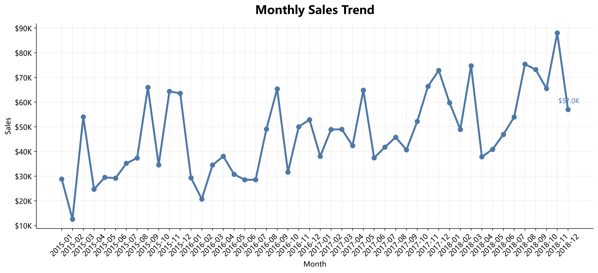

<div align="center">

# 📊 Superstore 销售数据分析

### 基于 Python、MySQL 与数据可视化的端到端数据分析项目


</div>

---

# 📖 项目概述

本项目基于 **Superstore Sales 数据集**，展示了一套完整的商业数据分析流程。

项目从原始 CSV 数据开始，通过 Python 将数据导入 MySQL，随后完成 SQL 业务分析、探索性数据分析（EDA）、商业可视化，并最终自动生成 Word 格式的数据分析报告。

该项目主要用于展示 **数据分析、商业分析以及 Python 数据处理** 相关能力。



---

# 🎯 项目目标

- 将原始 CSV 数据导入 MySQL
- 使用 SQL 完成业务指标分析
- 使用 Python 进行探索性数据分析（EDA）
- 构建商业风格的数据可视化图表
- 自动生成 Word 数据分析报告
- 展示完整的端到端数据分析工作流

---

# 📂 项目结构

```text
superstore-sales-analysis
│
├── data
│   ├── train.csv
│   └── clean_superstore.csv
│
├── image
│   ├── monthly_sales.png
│   ├── category_sales.png
│   ├── region_sales.png
│   ├── segment_sales.png
│   ├── top10_products.png
│   └── sales_distribution.png
│
├── python
│   ├── 01_import_mysql.py
│   ├── 02_eda_analysis.py
│   ├── 03_visualization.py
│   └── 04_export_report.py
│
├── sql
│   └── analysis.sql
│
├── report
│   └── Superstore_Report.docx
│
├── README.md
├── requirements.txt
└── .gitignore
```

---

# 🔄 数据分析流程

```text
CSV 原始数据
      │
      ▼
导入 MySQL
      │
      ▼
SQL 业务分析
      │
      ▼
Python EDA
      │
      ▼
商业数据可视化
      │
      ▼
Word 分析报告
```

---

# 📊 数据集信息

| 项目 | 内容 |
|------|------|
| 数据集 | Superstore Sales |
| 数据量 | 9,800 条 |
| 字段数量 | 18 |
| 缺失值 | Postal Code（11 条） |
| 数据库 | MySQL |

---

# 🛠 技术栈

| 技术 | 用途 |
|------------|-------------|
| Python | 数据分析与自动化 |
| MySQL | 数据库存储 |
| Pandas | 数据清洗与处理 |
| SQLAlchemy | Python 与数据库连接 |
| PyMySQL | MySQL 驱动 |
| Matplotlib | 数据可视化 |
| python-docx | Word 报告生成 |
| OpenPyXL | Excel 数据处理 |

---

# 📈 SQL 业务分析

SQL 模块主要包括：

- 总销售额
- 总订单量
- 平均销售额
- 月度销售趋势
- 商品类别分析
- 区域销售分析
- Top 产品分析
- Top 客户分析

---

# 🔍 探索性数据分析（EDA）

EDA 主要包括：

- 数据概览
- 数据类型检查
- 缺失值检测
- 重复值检测
- 描述性统计
- 销售额分析
- 品类分析
- 区域分析
- 客户群体分析
- Top 产品分析

---

# 📊 数据可视化

项目会自动生成以下图表：

| 图表 | 说明 |
|--------|-------------|
| 📈 Monthly Sales Trend | 月度销售趋势 |
| 📊 Sales by Category | 不同商品类别销售表现 |
| 🌍 Sales by Region | 不同区域销售表现 |
| 👥 Sales by Segment | 客户群体销售分析 |
| 🏆 Top 10 Products | 销售额最高的 10 个产品 |
| 📉 Sales Distribution | 销售额分布情况 |

所有图表均导出为高分辨率 PNG 图片。

---

# 📄 自动化商业报告

项目会自动生成：

```text
Superstore_Report.docx
```

报告主要包含：

- 执行摘要
- 业务概览
- 六张核心业务图表
- 关键分析发现
- 商业结论

---

# 📌 核心分析结论

- 总销售额超过 **226 万美元**
- Technology 类别贡献最高销售额
- West 区域整体销售表现最佳
- Consumer 客户群体贡献最大销售额
- 销售数据呈现明显长尾分布
- 高价值产品对整体销售额影响较大

---

# ▶️ 项目运行方式

## Step 1：安装依赖

在项目根目录运行：

```powershell
python -m venv .venv
.\.venv\Scripts\Activate.ps1
python -m pip install -r requirements.txt
```

## Step 2：配置 MySQL

首先创建：

```text
superstore_analysis
```

数据库。

然后复制示例环境变量配置：

```powershell
Copy-Item .env.example .env
```

打开 `.env` 文件，将：

```text
replace_with_your_password
```

替换为本地 MySQL 密码。

`.env` 文件已经排除在 Git 跟踪之外，不应上传到 GitHub。

## Step 3：导入数据到 MySQL

```powershell
python python/01_import_mysql.py
```

## Step 4：运行 SQL 分析

执行：

```text
sql/analysis.sql
```

## Step 5：执行 Python EDA

```powershell
python python/02_eda_analysis.py
```

## Step 6：生成数据可视化

```powershell
python python/03_visualization.py
```

## Step 7：生成 Word 商业报告

```powershell
python python/04_export_report.py
```

项目中的 Python 脚本均使用相对路径，因此克隆到其他本地目录后也可以正常运行。

---

# 📷 项目输出

项目运行完成后会生成：

```text
clean_superstore.csv
```

```text
6 张商业分析图表
```

```text
Superstore_Report.docx
```

---

# 🚀 项目能力展示

✔ Python 数据处理

✔ SQL 业务查询

✔ MySQL 数据库

✔ 数据清洗

✔ 探索性数据分析（EDA）

✔ 商业数据可视化

✔ 自动化报告生成

✔ 数据故事表达

---

# 📚 后续优化方向

- 使用 Power BI 构建 Dashboard
- 使用 Plotly 构建交互式可视化
- 销售预测模型
- 客户分群分析
- 利润分析
- 时间序列预测

---

# 👨‍💻 作者

**xsoou**

Data Analysis Portfolio

2026

---

<div align="center">

⭐ 如果这个项目对你有帮助，欢迎 Star！

</div>
